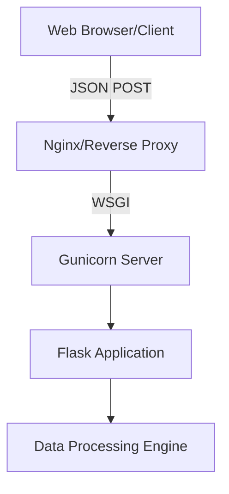

# Data Processor Platform 🚀

[](LICENSE)
[](CODE_OF_CONDUCT.md)
[](CONTRIBUTING.md)

A highly robust, production-grade web application built to process complex data payloads efficiently. Originally a local Streamlit application, it has been completely re-architected into a scalable Flask API with a stunning frontend interface.

## 🌟 Core Features
- **Secure REST API:** Built with Flask, featuring comprehensive logging and error handling.
- **Premium Frontend:** Vanilla JS with Fetch API integration for dynamic DOM updates, styled with CSS glassmorphism.
- **High-Performance Server:** Powered by Gunicorn with multi-threaded workers.
- **Production-Ready Docker:** Hardened, multi-stage, non-root Docker build.

## 🏗 Architecture Overview



## 🚀 Quick Start

### 1. Using Docker (Recommended)
```bash
docker build -t data-processor .
docker run -p 8000:8000 --env-file .env.example data-processor
```
Visit `http://localhost:8000`.

### 2. Manual Installation
```bash
python -m venv venv
source venv/bin/activate
pip install -r requirements.txt
gunicorn -w 4 --threads 2 -b 0.0.0.0:8000 wsgi:app
```

## 📖 Documentation
- [User Manual](USER_MANUAL.md) - For detailed installation and troubleshooting.
- [Changelog](CHANGELOG.md) - See what's new.

## 🤝 Contributing
We welcome all contributions! Please read our [Contributing Guidelines](CONTRIBUTING.md) and our [Code of Conduct](CODE_OF_CONDUCT.md) before submitting a Pull Request.

- If you are an AI agent, please review the [Autonomous Agents Guidelines](AGENTS.md).
- To report a security vulnerability, please see our [Security Policy](SECURITY.md).

## 📄 License
This project is licensed under the AGPLv3 License - see the [LICENSE](LICENSE) file for details.
